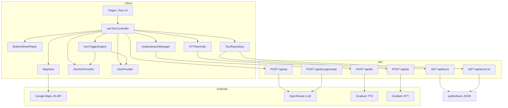
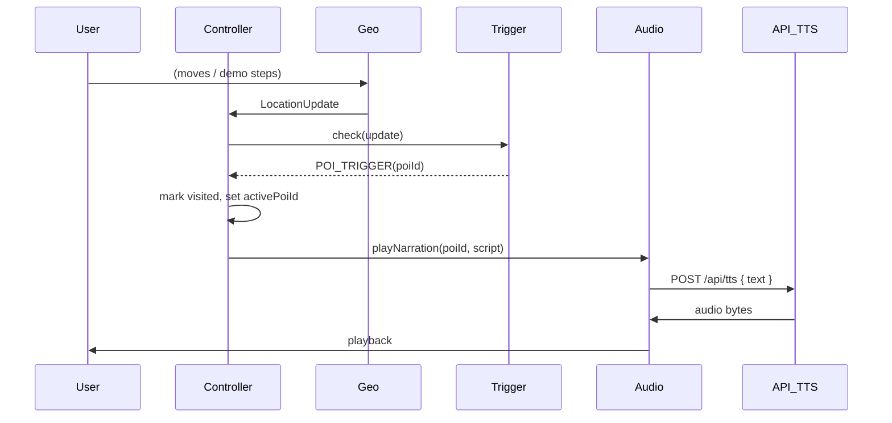
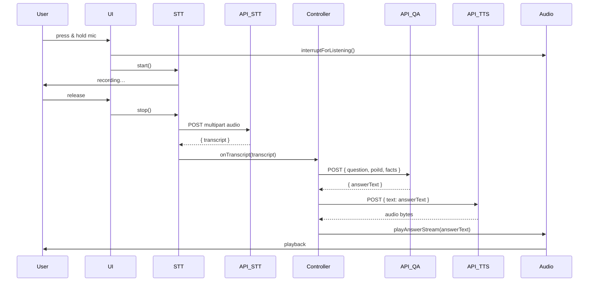

# Odyssey Walk — Architecture

## Overview

Odyssey Walk is a mobile-first, voice-first audio tour app. The client loads tour data from JSON (or generated via LLM), displays a Google Map with route and POIs, and uses geofencing or demo simulation to trigger narration. Voice Q&A is implemented via press-and-hold STT → OpenRouter LLM → TTS playback.

## Component diagram (Mermaid)

## Sequence: POI trigger → narration

## Sequence: Ask Q&A loop

## Key files

| Layer        | Files |
|-------------|--------|
| Types       | `lib/types.ts` |
| Data        | `lib/data/TourRepository.ts` |
| Maps        | `lib/maps/MapLoader.ts`, `polyline.ts`, `haversine.ts` |
| Geo         | `lib/geo/GeoProvider.ts`, `GeoSimProvider.ts`, `GeoTriggerEngine.ts` |
| Audio/Voice | `lib/audio/AudioSessionManager.ts`, `lib/voice/STTRecorder.ts` |
| UI          | `components/MapView.tsx`, `BottomSheetPlayer.tsx`, `TourCard.tsx`, etc. |
| Controller  | `hooks/useTourController.ts` |
| API         | `app/api/tours/`, `app/api/qa/`, `app/api/tts/`, `app/api/stt/`, `app/api/tour/generate/` |

## Secrets

- **Client:** only `NEXT_PUBLIC_GOOGLE_MAPS_API_KEY`.
- **Server:** `OPENROUTER_API_KEY`, `GRADIUM_API_KEY`, `GRADIUM_TTS_URL`, `GRADIUM_STT_URL`.
